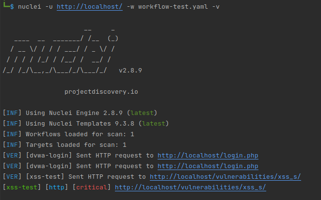

# DVWA XSS testing on Docker and Jenskins

This project contains the following components:
- Docker
- DVWA
- Nuclei
- Jenkins

## Installation

1. Clone this repository to your local machine.
2. Ensure that you have Docker and Docker Compose installed.
3. Run `docker-compose up -d` to start DVWA on port 80 and Jenkins on port 8080.

## Usage

### Nuclei
1. The Nuclei template is located in the `nuclei_temp` folder.
2. To use it, run `nuclei -u http://localhost -w workflow-test.yaml`.
3. This workflow will test the login and stored XSS on DVWA.

### Jenkins
1. The project can be piped into Jenkins for continuous integration and testing.
2. Set up a Jenkins pipeline with the appropriate stages to build and test the project.

## Contributing

Pull requests are welcome. For major changes, please open an issue first to discuss what you would like to change.

